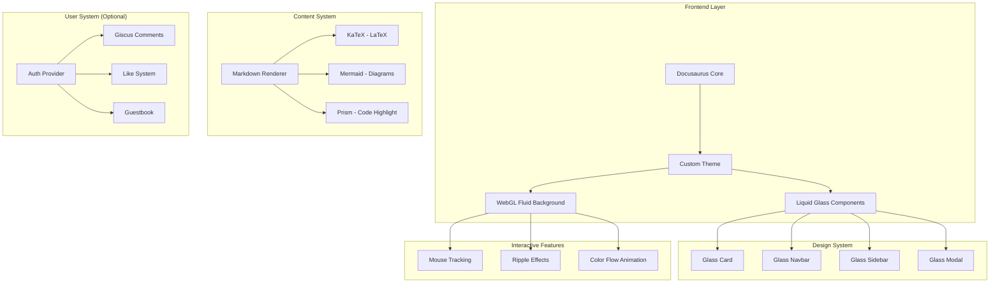

# Design Document: Liquid Glass Theme

## Overview

将 Docusaurus 博客改造为液态玻璃（Liquid Glass）风格，融合 Notion 极简设计理念。整体设计追求高留白、非衬线字体、细腻边框，所有组件应用毛玻璃效果。Hero 区域实现基于 WebGL/Canvas 的动态流体背景，支持鼠标交互产生波动效果。

### Design Principles (基于 ui-ux-pro-max 规范)

1. **No emoji icons** - 使用 SVG 图标 (Lucide React)
2. **Stable hover states** - 使用 color/opacity 过渡，避免 scale 导致布局偏移
3. **Cursor pointer** - 所有可点击元素添加 `cursor-pointer`
4. **Glass card light mode** - 使用 `bg-white/80` 或更高透明度
5. **Floating navbar** - 添加 `top-4 left-4 right-4` 间距
6. **Smooth transitions** - 使用 `transition-colors duration-200`

## Architecture



## Components and Interfaces

### 1. Design Token System

```typescript
// src/theme/tokens.ts
export const tokens = {
  // Color Palette (4 colors for fluid animation)
  colors: {
    primary: '#6366F1',    // Indigo - 主色
    secondary: '#8B5CF6',  // Violet - 辅助色
    accent: '#EC4899',     // Pink - 强调色
    highlight: '#06B6D4',  // Cyan - 高亮色
    
    // Neutral colors
    background: {
      light: '#FAFAFA',
      dark: '#0A0A0A',
    },
    text: {
      primary: {
        light: '#0F172A',  // slate-900
        dark: '#F8FAFC',   // slate-50
      },
      secondary: {
        light: '#475569',  // slate-600
        dark: '#94A3B8',   // slate-400
      },
    },
    border: {
      light: 'rgba(0, 0, 0, 0.08)',
      dark: 'rgba(255, 255, 255, 0.1)',
    },
  },
  
  // Glass Effect
  glass: {
    background: {
      light: 'rgba(255, 255, 255, 0.8)',
      dark: 'rgba(10, 10, 10, 0.8)',
    },
    blur: '12px',
    border: {
      light: 'rgba(0, 0, 0, 0.05)',
      dark: 'rgba(255, 255, 255, 0.1)',
    },
  },
  
  // Typography (MiSans - 非衬线字体)
  typography: {
    fontFamily: '"MiSans", -apple-system, BlinkMacSystemFont, "Segoe UI", sans-serif',
    fontSize: {
      xs: '0.75rem',
      sm: '0.875rem',
      base: '1rem',
      lg: '1.125rem',
      xl: '1.25rem',
      '2xl': '1.5rem',
      '3xl': '1.875rem',
      '4xl': '2.25rem',
    },
    fontWeight: {
      normal: 400,
      medium: 500,
      semibold: 600,
    },
    lineHeight: {
      tight: 1.25,
      normal: 1.5,
      relaxed: 1.75,
    },
  },
  
  // Spacing (高留白)
  spacing: {
    page: {
      x: '1.5rem',      // 页面水平内边距
      y: '2rem',        // 页面垂直内边距
    },
    section: '4rem',    // 区块间距
    card: '1.5rem',     // 卡片内边距
  },
  
  // Border (极其细腻)
  border: {
    width: '1px',
    radius: {
      sm: '0.5rem',
      md: '0.75rem',
      lg: '1rem',
      xl: '1.5rem',
    },
  },
  
  // Transitions
  transition: {
    fast: '150ms ease',
    normal: '200ms ease',
    slow: '300ms ease',
  },
}
```

### 2. Glass Component Base

```typescript
// src/components/Glass/GlassCard.tsx
interface GlassCardProps {
  children: React.ReactNode
  className?: string
  hover?: boolean
}

export function GlassCard({ children, className, hover = true }: GlassCardProps) {
  return (
    <div
      className={cn(
        // Base glass effect
        'backdrop-blur-md',
        'bg-white/80 dark:bg-black/80',
        'border border-black/5 dark:border-white/10',
        'rounded-xl',
        // Hover effect (stable, no scale)
        hover && [
          'cursor-pointer',
          'transition-colors duration-200',
          'hover:bg-white/90 dark:hover:bg-black/90',
          'hover:border-black/10 dark:hover:border-white/20',
        ],
        className
      )}
    >
      {children}
    </div>
  )
}
```

### 3. WebGL Fluid Background Component

```typescript
// src/components/FluidBackground/index.tsx
interface FluidBackgroundProps {
  colors?: string[]  // 4 colors for animation
  intensity?: number // Mouse interaction intensity
}

// 使用 WebGL shader 实现流体效果
// 核心算法：Navier-Stokes 流体模拟简化版
export function FluidBackground({ 
  colors = ['#6366F1', '#8B5CF6', '#EC4899', '#06B6D4'],
  intensity = 0.5 
}: FluidBackgroundProps) {
  const canvasRef = useRef<HTMLCanvasElement>(null)
  const mouseRef = useRef({ x: 0, y: 0 })
  
  useEffect(() => {
    // WebGL 初始化
    // 1. 创建 shader program
    // 2. 设置 uniform 变量 (colors, time, mouse position)
    // 3. 渲染循环
  }, [])
  
  // Mouse tracking
  const handleMouseMove = useCallback((e: MouseEvent) => {
    mouseRef.current = {
      x: e.clientX / window.innerWidth,
      y: e.clientY / window.innerHeight,
    }
  }, [])
  
  return (
    <canvas
      ref={canvasRef}
      className="fixed inset-0 -z-10 w-full h-full"
      style={{ pointerEvents: 'none' }}
    />
  )
}
```

### 4. Navbar Component (Floating Glass)

```typescript
// src/theme/Navbar/index.tsx
export function Navbar() {
  return (
    <nav
      className={cn(
        // Floating position (ui-ux-pro-max 规范)
        'fixed top-4 left-4 right-4 z-50',
        // Glass effect
        'backdrop-blur-md',
        'bg-white/80 dark:bg-black/80',
        'border border-black/5 dark:border-white/10',
        'rounded-2xl',
        // Shadow
        'shadow-lg shadow-black/5',
        // Padding
        'px-6 py-3',
      )}
    >
      {/* Logo */}
      <div className="flex items-center gap-8">
        <Logo />
        <NavItems />
        <ThemeToggle />
      </div>
    </nav>
  )
}
```

## Data Models

### Blog Post Frontmatter

```yaml
---
title: "文章标题"
slug: my-first-post
date: 2025-01-04
authors: [liam]
tags: [react, typescript]
description: "文章描述"
image: /img/cover.png
---
```

### Blog Directory Structure

```
blog/
├── authors.yml           # 作者信息
├── 2025-01-04-my-post/   # 日期前缀目录
│   ├── index.md          # 文章内容
│   └── img/              # 文章图片
└── my-simple-post.md     # 简单文章
```

## Error Handling

### WebGL Fallback

```typescript
// 检测 WebGL 支持
function checkWebGLSupport(): boolean {
  try {
    const canvas = document.createElement('canvas')
    return !!(
      window.WebGLRenderingContext &&
      (canvas.getContext('webgl') || canvas.getContext('experimental-webgl'))
    )
  } catch (e) {
    return false
  }
}

// 降级方案：CSS 渐变动画
function CSSFallbackBackground() {
  return (
    <div 
      className="fixed inset-0 -z-10"
      style={{
        background: 'linear-gradient(-45deg, #6366F1, #8B5CF6, #EC4899, #06B6D4)',
        backgroundSize: '400% 400%',
        animation: 'gradient 15s ease infinite',
      }}
    />
  )
}
```

### Reduced Motion Support

```typescript
// 尊重用户的动画偏好设置
const prefersReducedMotion = window.matchMedia('(prefers-reduced-motion: reduce)').matches

if (prefersReducedMotion) {
  // 禁用流体动画，使用静态渐变
}
```

## Testing Strategy

### Visual Testing

1. **Light/Dark Mode** - 测试两种模式下的对比度和可见性
2. **Responsive** - 测试 320px, 768px, 1024px, 1440px 断点
3. **Glass Effect** - 确保毛玻璃效果在不同背景下可见

### Performance Testing

1. **WebGL FPS** - 确保流体动画保持 60fps
2. **Memory** - 监控 WebGL 内存使用
3. **Bundle Size** - 确保 WebGL 代码按需加载

### Accessibility Testing

1. **Contrast Ratio** - 确保文本对比度 >= 4.5:1
2. **Keyboard Navigation** - 确保所有交互元素可通过键盘访问
3. **Screen Reader** - 确保所有图片有 alt 文本

## Implementation Phases

### Phase 1: Design System Foundation
- [ ] 创建 design tokens
- [ ] 实现 GlassCard 基础组件
- [ ] 更新全局 CSS 变量

### Phase 2: Core Components
- [ ] 改造 Navbar (floating glass)
- [ ] 改造 Footer (glass effect)
- [ ] 改造 Sidebar (glass effect)
- [ ] 改造 Card 组件

### Phase 3: Hero & Animation
- [ ] 实现 WebGL Fluid Background
- [ ] 添加鼠标交互效果
- [ ] 实现 CSS 降级方案

### Phase 4: Content Enhancement
- [ ] 集成 KaTeX (LaTeX)
- [ ] 集成 Mermaid (流程图)
- [ ] 优化代码高亮样式

### Phase 5: Polish
- [ ] 响应式优化
- [ ] 性能优化
- [ ] 无障碍优化

## Pre-Delivery Checklist (基于 ui-ux-pro-max)

### Visual Quality
- [ ] No emojis used as icons (use Lucide React)
- [ ] All icons from consistent icon set
- [ ] Hover states don't cause layout shift

### Interaction
- [ ] All clickable elements have `cursor-pointer`
- [ ] Hover states provide clear visual feedback
- [ ] Transitions are smooth (150-300ms)
- [ ] Focus states visible for keyboard navigation

### Light/Dark Mode
- [ ] Light mode text has sufficient contrast (4.5:1 minimum)
- [ ] Glass elements visible in light mode (`bg-white/80`)
- [ ] Borders visible in both modes
- [ ] Test both modes before delivery

### Layout
- [ ] Floating navbar has proper spacing from edges
- [ ] No content hidden behind fixed navbar
- [ ] Responsive at 320px, 768px, 1024px, 1440px
- [ ] No horizontal scroll on mobile

### Accessibility
- [ ] All images have alt text
- [ ] Form inputs have labels
- [ ] Color is not the only indicator
- [ ] `prefers-reduced-motion` respected
